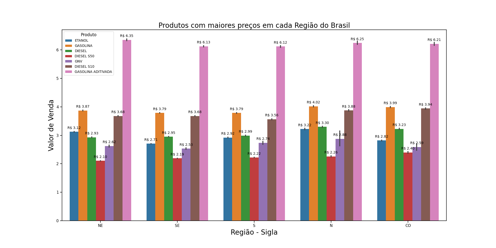
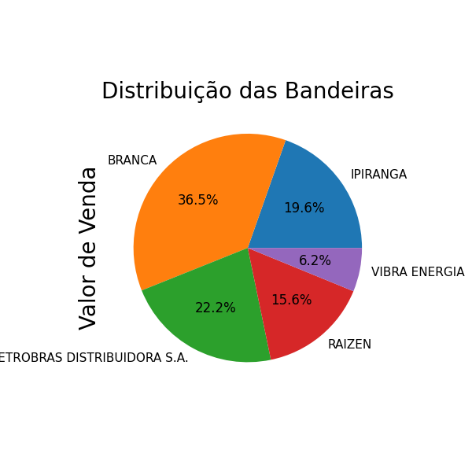

# Previsão de Preço da Gasolina - Combustíveis Automotivos (2012-2022)

Caso tenha interesse em colaborar ou obter mais informações, sinta-se à vontade para entrar em [contato comigo pelo LinkedIn](https://www.linkedin.com/in/jackson-vieira/).

## Descrição do Projeto

Este projeto foi finalizado em sua fase atual e teve como objetivo realizar a previsão do preço da gasolina para o período de 2012 a 2022. Utilizamos um conjunto de dados contendo informações sobre os combustíveis automotivos coletados ao longo desses anos. Os dados são provenientes do governo brasileiro e foram obtidos no site dados.gov.br.

## Sobre os Dados

Os dados utilizados contêm as seguintes colunas:

- Região: Região geográfica do Brasil onde a coleta foi realizada.
- Estado - Sigla: Sigla do estado onde a coleta foi realizada.
- Município: Nome do município onde a coleta foi realizada.
- Produto: Tipo de combustível coletado.
- Data da Coleta: Data em que o preço do combustível foi coletado.
- Valor de Venda: Preço de venda do combustível na data da coleta.
- Unidade de Medida: Unidade de medida utilizada para o preço do combustível.
- Bandeira: Bandeira da revenda de combustível.

## Objetivo

O objetivo principal deste projeto foi analisar os dados históricos de preços da gasolina e, com base nessa análise, desenvolver um modelo de previsão que permita estimar o preço futuro da gasolina. Isso pode ser útil para diversas aplicações, como planejamento financeiro, análise de mercado e tomada de decisões estratégicas.

## Metodologia

Para a previsão do preço da gasolina, empregamos técnicas de aprendizado de máquina e análise de séries temporais. Realizamos a limpeza e o tratamento dos dados, exploramos padrões e tendências temporais, e aplicamos modelos de regressão e outras técnicas de previsão para construir o modelo.

## Resultados até então

Aqui estão algumas visualizações geradas a partir dos dados:

### Produtos com Maiores Preços em Cada Região do Brasil

Nesta visualização, mostramos os produtos com os maiores preços em cada região do Brasil.

### Distribuição do Valor de Venda por Região

Este gráfico apresenta a distribuição do valor de venda por região, destacando as variações nos preços entre diferentes áreas geográficas.

### Distribuição das Bandeiras de Combustível Específicas

Nessa visualização, exploramos a distribuição das bandeiras de combustível específicas e suas participações nas vendas totais.

## Conclusão

Por enquanto, esta fase do projeto foi finalizada, atingindo os objetivos propostos de análise e previsão dos preços da gasolina. No entanto, esta jornada está longe de terminar. Pretendo continuar refinando a análise, explorando novas técnicas e incorporando mais dados conforme a evolução do projeto. Novas contribuições e aprimoramentos são bem-vindos para enriquecer ainda mais o trabalho realizado até o momento. Caso tenha interesse em colaborar ou obter mais informações, sinta-se à vontade para entrar em [contato comigo pelo LinkedIn](https://www.linkedin.com/in/jackson-vieira/).

